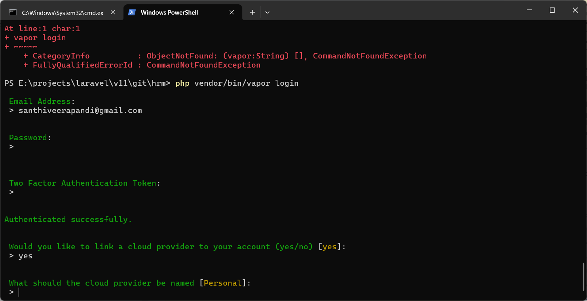
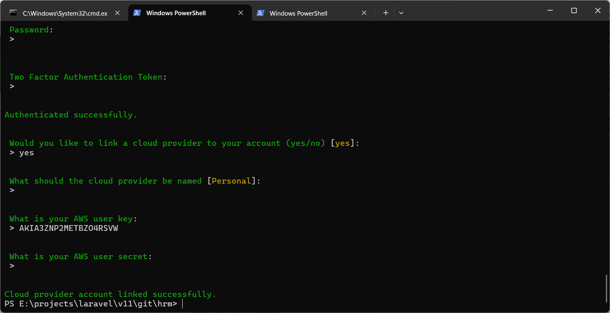

## Installation
```
$ composer create-project --prefer-dist laravel/laravel hrm
$ cd hrm
$ npm install
$ npm list --json

# .env file DB configuration changes
DB_CONNECTION=mysql
DB_HOST=127.0.0.1
DB_PORT=3306
DB_DATABASE=hrm
DB_USERNAME=hrm
DB_PASSWORD=hrm@123
DB_PREFIX=hrm_

# config/database.php
'mysql' => [
    ....
    'prefix' => env('DB_PREFIX', 'hrm_'),


$ php artisan migrate

# Check Environment
$ php artisan about


$ php artisan env:encrypt

$ php artisan config:publish
```
## Laravel authentication
```
$ composer require laravel/ui
$ php artisan ui bootstrap
$ php artisan ui bootstrap --auth
$ npm install
$ npm run build
```

## Theme Integration
```
$ composer require jeroennoten/laravel-adminlte
$ php artisan adminlte:install
$ php artisan adminlte:install --only=auth_views
```

## Registered user email verification
```
## routes/web.php
// Add this to enable email verification routes
Auth::routes(['verify' => true]);

Route::middleware(['auth', 'verified'])->group(function () {
    Route::get('/home', [App\Http\Controllers\HomeController::class, 'index'])->name('home');
});
Route::post('email/verification-notification', [App\Http\Controllers\Auth\EmailVerificationNotificationController::class, 'store'])
    ->middleware(['auth', 'throttle:6,1'])
    ->name('verification.send');

-------------------
## app/Http/Controllers/Auth/EmailVerificationNotificationController.php

namespace App\Http\Controllers\Auth;

use App\Http\Controllers\Controller;
use Illuminate\Http\Request;

class EmailVerificationNotificationController extends Controller
{
    /**
     * Send a new email verification notification.
     *
     * @param  \Illuminate\Http\Request  $request
     * @return \Illuminate\Http\RedirectResponse
     */
    public function store(Request $request)
    {
        if ($request->user()->hasVerifiedEmail()) {
            return redirect()->intended('/home');
        }

        $request->user()->sendEmailVerificationNotification();

        return back()->with('status', 'verification-link-sent');
    }
}
-----------------------------
## app/Providers/AppServiceProvider.php

namespace App\Providers;

use Illuminate\Support\ServiceProvider;
use Illuminate\Auth\Notifications\VerifyEmail;
use Illuminate\Notifications\Messages\MailMessage;

class AppServiceProvider extends ServiceProvider
{
    ....
    public function boot(): void
    {
        VerifyEmail::toMailUsing(function (object $notifiable, string $url) {
        return (new MailMessage)
            ->subject('Verify Email Address')
            ->line('Click the button below to verify your email address.')
            ->action('Verify Email Address', $url);
        });
    }

```

## HMVC implementation
Reference [https://nwidart.com/laravel-modules/v6/installation-and-setup]

```
$ composer require nwidart/laravel-modules
$ php artisan vendor:publish --provider="Nwidart\Modules\LaravelModulesServiceProvider"
$ composer dump-autoload
```

## Env decrypt
```
php artisan env:decrypt --key=3UVsEgGVK36XN82KKeyLFMhvosbZN1aF
```

## Deployment
### Step 1: Code 
```
git clone https://github.com/Santhiveerapandi/hrm.git
cd hrm
composer install
php artisan env:decrypt --key=3UVsEgGVK36XN82KKeyLFMhvosbZN1aF
```
### Step 2: MYSQL
```
CREATE DATABASE hrm;
CREATE USER 'hrm'@'%' IDENTIFIED BY 'hrm@123';
GRANT ALL PRIVILEGES ON hrm.* TO 'hrm'@'%';
FLUSH PRIVILEGES;
SHOW DATABASES;
SELECT user, host FROM mysql.user;
EXIT;
```
### Step 3: Establish DB Connection
```
php artisan migrate --seed
npm install
npm run build
php artisan serve
```
### Step 4: Checking Application
http://localhost:8000/login
Login Credential
Email: test@example.com
pass:  password

@@@@@@@@@@@@@@@@@@@@@@@@@@@@@@@@@@@@@@@@@@@@@@@@@@@@@@@@@@@@@@@@@

### Vapor Enviroment
Reference: https://docs.vapor.build/introduction.html#what-is-vapor

#### install the vapor cli
> composer require laravel/vapor-cli --update-with-dependencies

> php vendor/bin/vapor list

> php vendor/bin/vapor help deploy

> php vendor/bin/vapor login





> php vendor/bin/vapor team:current

> php vendor/bin/vapor init

Reference: https://youtube.com/playlist?list=PLcjapmjyX17gqhjUz8mgTaWzSv1FPgePD&si=b6BT6U3eYKZEYz2o

#### create lamda function url
https://us-east-2.console.aws.amazon.com/lambda/home?region=us-east-2#/functions

https://docs.aws.amazon.com/lambda/latest/dg/urls-configuration.html

https://5cnqe3ti34vyb6z6sqp6h535iy0hqldt.lambda-url.us-east-2.on.aws/